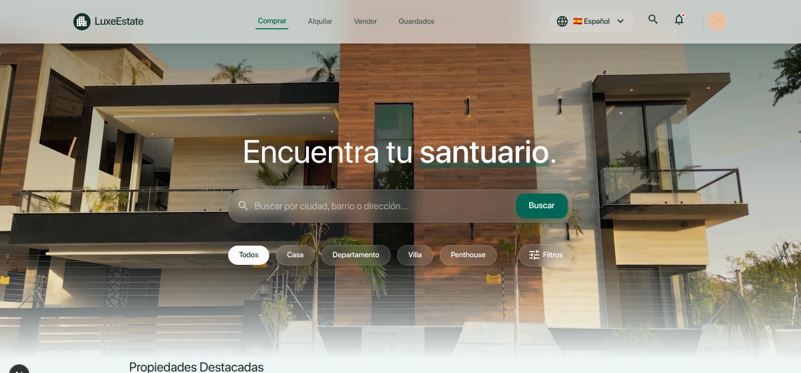
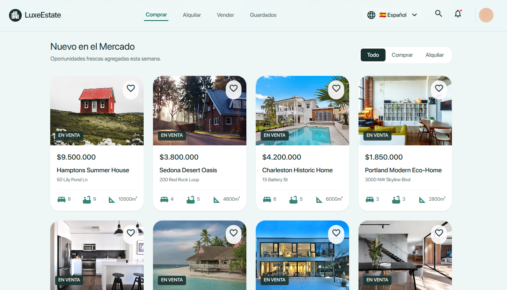
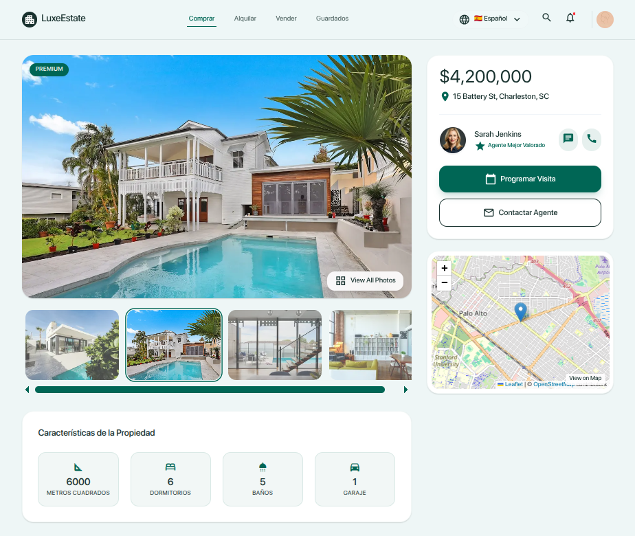

<p align="center">
  
</p>

<h1 align="center">🏡 Luxe Estate</h1>

<p align="center">
  <strong>Premium Real Estate Platform</strong> —
  Encuentra tu santuario. Find your sanctuary. Encontre o seu santuário.
</p>

<p align="center">
  
  
  
  
  
  
</p>

---

## ✨ Features

- 🔍 **Búsqueda avanzada** con filtros por tipo, precio, dormitorios, baños y ubicación
- 🏆 **Propiedades destacadas** con diseño exclusivo
- 📸 **Galería interactiva** de imágenes por propiedad
- 🗺️ **Mapa interactivo** con Leaflet + OpenStreetMap
- 🧮 **Calculadora de hipoteca** integrada
- 🌐 **3 idiomas**: Español, English, Português (detección automática del navegador)
- 📱 **Responsive design** — mobile-first
- 🎨 **Paleta de colores premium**: mosque green (#006655) + nordic dark
- ⚡ **Rendimiento** con Next.js 16 Turbopack

## 🛠️ Tech Stack

| Capa | Tecnología |
|------|-----------|
| **Framework** | Next.js 16 (App Router) |
| **Frontend** | React 19 + TypeScript 5 |
| **Estilos** | Tailwind CSS v4 |
| **Base de datos** | Supabase (PostgreSQL) |
| **Mapas** | Leaflet + react-leaflet |
| **i18n** | next-intl (es, en, pt) |
| **Linting** | ESLint 9 |

## 📁 Estructura del Proyecto

```
app/
├── [locale]/            # Rutas internacionalizadas
│   ├── page.tsx         # Home: Hero + Destacados + Listado
│   └── propiedades/
│       └── [slug]/      # Detalle de propiedad

components/
├── home/                # Hero, filtros, listados
├── property/            # Tarjetas, galería, mapa, hipoteca
└── ui/                  # Navbar, LanguageSelector, LocaleDebug

lib/
├── properties.ts        # Queries a Supabase
└── supabase/            # Cliente Supabase

messages/                # Traducciones (es.json, en.json, pt.json)
i18n/                    # Configuración de internacionalización
scripts/                 # Seed de datos y utilidades
```

## 🚀 Getting Started

```bash
# 1. Clonar
git clone https://github.com/GeomaticaNet/luxu-estate.git
cd luxu-estate

# 2. Instalar dependencias
npm install

# 3. Configurar variables de entorno
cp .env.template .env.local
# Editar .env.local con tus credenciales de Supabase

# 4. Iniciar dev server
npm run dev
```

Abrir [http://localhost:3000](http://localhost:3000) 🚀

## 🗄️ Base de Datos

El proyecto usa **Supabase** con dos tablas principales:

- **`properties`** — Datos de las propiedades (título, precio, ubicación, amenities, etc.)
- **`property_images`** — Imágenes asociadas a cada propiedad

Para poblar la base de datos con datos de ejemplo:

```bash
node --env-file=.env.local scripts/seed.mjs
```

## 🌐 Internacionalización

El sitio detecta automáticamente el idioma del navegador. Idiomas disponibles:

| Código | Idioma | Traducción |
|--------|--------|------------|
| `es` | Español | `messages/es.json` |
| `en` | English | `messages/en.json` |
| `pt` | Português | `messages/pt.json` |

## 📸 Screenshots

<p align="center">
  
  <br>
  
  <br>
  
</p>

## 🧑‍💻 Desarrollo

```bash
npm run dev      # Desarrollo con Turbopack
npm run build    # Build de producción
npm run lint     # Linting
```

## 🐳 Despliegue

Desplegar en [Vercel](https://vercel.com/new):

[](https://vercel.com/new)

---

<p align="center">
  Hecho con ❤️ por <a href="https://github.com/GeomaticaNet">GeomaticaNet</a>
  <br>
  <sub>Argentina — 2026</sub>
</p>
